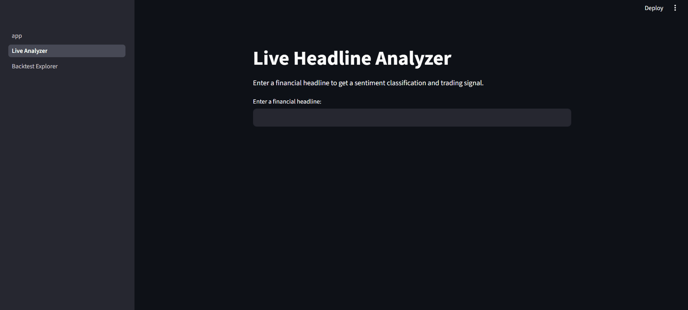

I did an Inspirit AI (NLP + Finance: Algo Trading) internship earlier this year and we built a sentiment classifier. I kept thinking, if a model can read financial news and tell whether it's positive or negative, can it actually tell you something useful about what the market does next? This project is my attempt to find out.

# NLP + Finance: Sentiment-Driven Trading Signals

## What I Found

- The classifier hits 0.73 weighted F1, 18+ points above the VADER baseline (0.54). LinearSVC and FinBERT trade off here. LinearSVC wins on overall F1, but FinBERT wins specifically on the negative class, which matters most for a trading system.
- The information coefficient between sentiment and next-day returns is -0.0165 (not significant), and the correlation is 0.0027 with a p-value of 0.93. An ADF test confirms the return series itself is stationary, so the methodology checks out, the signal is just genuinely weak given the simulated date assignment.
- The strategy returned 22.85% with LinearSVC signals and 97.50% with FinBERT signals vs buy-and-hold's 148.41% over the same period. It underperforms in both cases, which is expected since the dataset doesn't have real timestamped headlines.

## How It Works

Headlines from Financial PhraseBank get cleaned, tokenized, and vectorized with TF-IDF. Three models (Logistic Regression, Naive Bayes, LinearSVC) get trained and compared on weighted F1, given the class imbalance. FinBERT gets pulled in separately as a domain-specific comparison.

Sentiment scores (P(positive) minus P(negative)) get mapped to BUY/SELL/HOLD signals with a 1-day lag to avoid look-ahead bias, then backtested against simply buying and holding AAPL. I checked the result with a t-test, an ADF stationarity test, and the information coefficient, and all three confirm the correlation is essentially zero, mostly because the dataset doesn't have real dates and headlines had to be randomly assigned to trading days.

A 2-page Streamlit app lets you type any headline and see the live sentiment and signal, plus explore the backtest results.

## Setup

git clone https://github.com/prisha-x/nlp-finance-sentiment-analysis

cd nlp-finance-sentiment-analysis

pip install -r requirements.txt

Dataset download instructions are in `data/README.md`. Stock data fetches automatically via yfinance.

## What I'd Do Differently / Next

If I did this again, I'd start with real timestamped news data. The random date assignment was the biggest limitation, and I knew it going in. I'd also try fine-tuning FinBERT rather than using it off-the-shelf, and I'd test on more than one stock, since AAPL in a bull run isn't exactly a representative sample.

  

Extended independently from my Inspirit AI Scholars Program project (March 2026). The program got me started, the questions it left unanswered are what actually got me building.